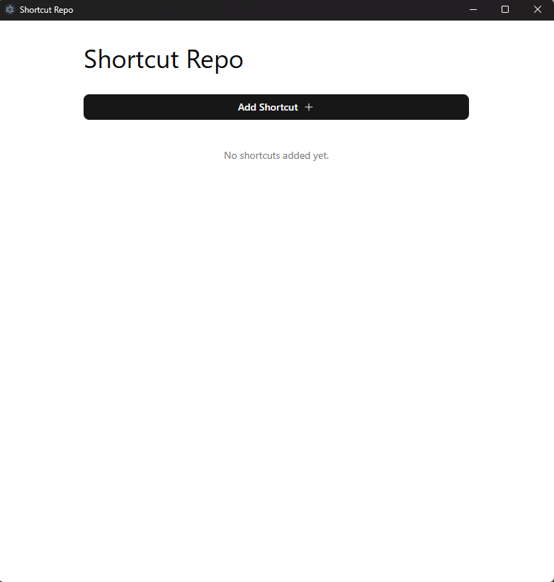
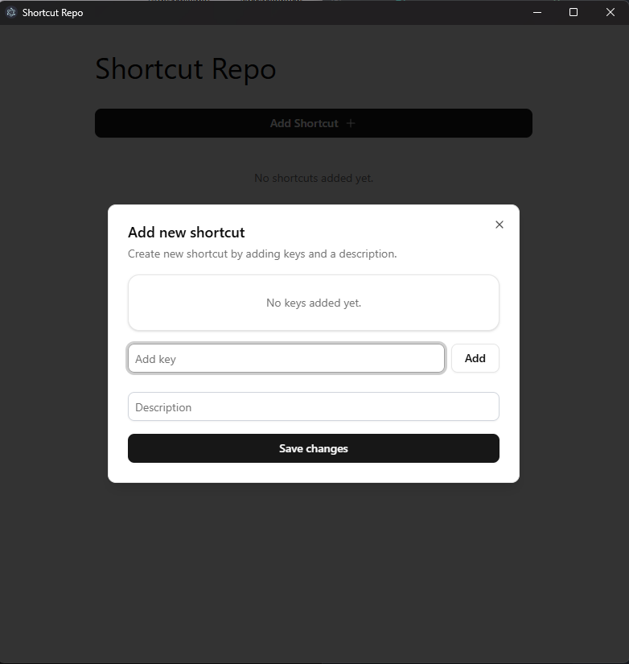
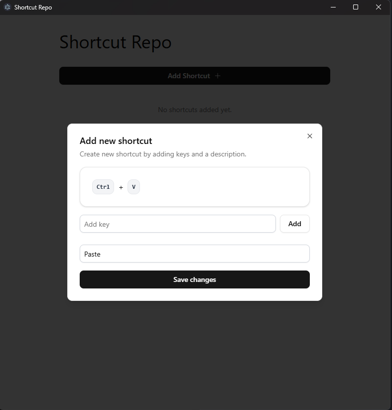
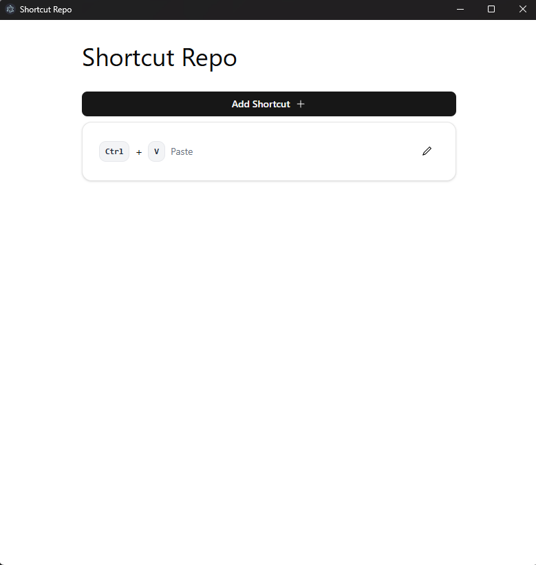
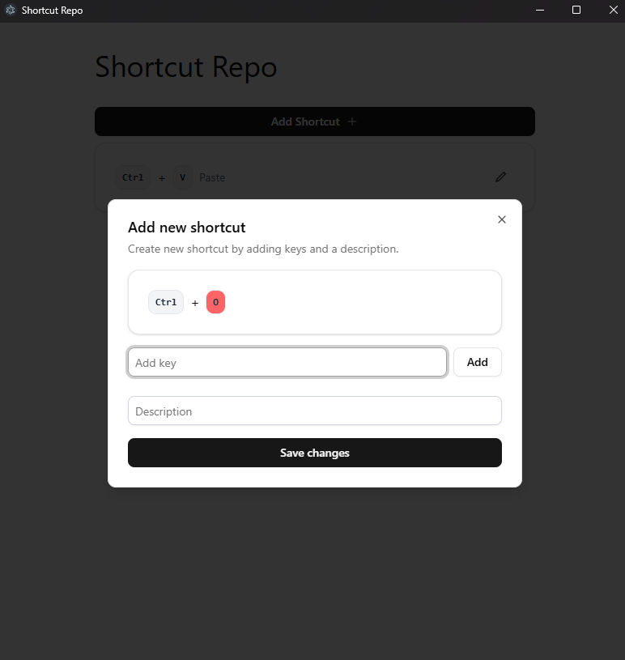

# Shortcut Repo

A simple desktop application built with Electron, Vue.js, and TypeScript for managing shortcuts.

## Features

- Add new shortcuts.

## Tech Stack

- [Electron](https://www.electronjs.org/)
- [TypeScript](https://www.typescriptlang.org/)
- [Vite](https://vitejs.dev/)
- [Vue.js](https://vuejs.org/)
- [shadcn-vue](https://www.shadcn-vue.com/)

## ToDo

- Add Shortcut form validation messages. (Shortcut already exists, Too few keys, Description is mandatory, etc.)
- Implement persistence for shortcuts using either an SQLite database or a CSV file, so they are saved after closing the application.

## Screens

### Empty List

### Add Shortcut - Dialog

### Add new Shortcut

### Shortcut List

### Remove Key

